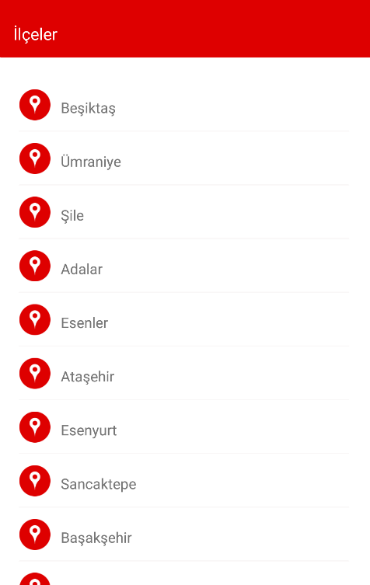
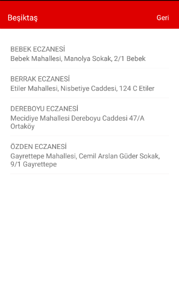

# pharmacyonduty-mobile
React Native implementation for Pharmacy *on duty* (https://github.com/emre/PharmacyOnDuty)

pharmacyonduty uses react native, redux

**IOS**


**Android**




### Requirements
- [Xcode](https://developer.apple.com/xcode/)
- [Node](https://nodejs.org)
- [Brew](http://brew.sh/)
- [Git](https://git-scm.com/)

### Installation

```bash
$ npm install -g react-native-cli
$ brew install watchman
$ brew install flow
$ git clone git@github.com:bahattincinic/pharmacyonduty-mobile.git
$ cd pharmacyonduty-mobile && npm install
```

**Click the following links for more information:**
- [Android setup](https://facebook.github.io/react-native/docs/android-setup.html)
- [Getting started with react native](https://facebook.github.io/react-native/docs/getting-started.html)

### To run the project for Android

```bash
$ react-native run-android
```
Facebook recommended to Genymotion for Android Emulator. Genymotion is Fast And Easy Android Emulator.

### To run the project for IOS (require Xcode)

```bash
$ Open ios/LeonMobile.xcodeproj
Run project with xcode.
```
or
```bash
$ react-native run-ios
```

Xcode 7.0 or higher is required. It can be installed from the App Store.
